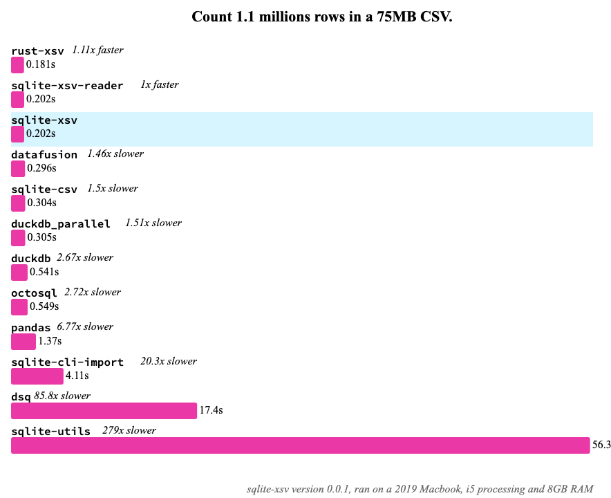

# sqlite-xsv

A fast and performant SQLite extension for CSV files, written in Rust! Based on [`sqlite-loadable-rs`](https://github.com/asg017/sqlite-loadable-rs) and the wonderful [csv crate](https://github.com/BurntSushi/rust-csv).

- Query CSVs, TSVs, and other-SVs as SQLite virtual tables
- The "reader" interface lets you query CSVs from other data sources, such as [`sqlite-http`](https://github.com/asg017/sqlite-http)
- Builtin support for querying CSVs with gzip or zstd compression

See [_Introducing sqlite-loadable-rs: A framework for building SQLite Extensions in Rust_](https://observablehq.com/@asg017/introducing-sqlite-xsv) (Jan 2023) for more details!

> **Note**
> Nothing to do with [xsv](https://github.com/BurntSushi/xsv), but is based on the same csv crate. This is named `sqlite-xsv` to distinguish between the official [SQLite CSV Virtual table](https://www.sqlite.org/csv.html) and the [`sqlean` vsv extension](https://github.com/nalgeon/sqlean/blob/main/docs/vsv.md).



## Usage

```sql
.load ./xsv0

create virtual table temp.students using csv(
  filename="students.csv"
);

select * from temp.students;
/*
┌────┬───────┬─────┬─────────┐
│ id │ name  │ age │ process │
├────┼───────┼─────┼─────────┤
│ 1  │ alex  │ 10  │ .9      │
│ 2  │ brian │ 20  │ .7      │
│ 3  │ craig │ 30  │ .3      │
└────┴───────┴─────┴─────────┘
*/
```

Provide a schema for CSVs that lack headers, or to provide types on columns.

```sql
create virtual table students_no_header using csv(
  filename="students_no_header.csv",
  header=false,
  id text,
  name text,
  age int,
);

select * from students_no_header;

```

Use the [`csv_reader`](/docs.md#xsv_reader) API and the `fsdir()` function in the SQLite CLI to read from several CSV files in one query.

```sql
create virtual table temp.students_reader using csv_reader(
  id integer,
  name text,
  age integer,
  progess real
);

with files as (
   select name as path
   from fsdir('tests/data/student_files')

)
select
  files.path,
  students.*
from files
join students_reader(files.path) as students
where files.path like '%.csv';
/*
┌────────────────────────────────┬────┬───────────┬─────┬─────────┐
│              path              │ id │   name    │ age │ progess │
├────────────────────────────────┼────┼───────────┼─────┼─────────┤
│ tests/data/student_files/a.csv │ 1  │ alex      │ 10  │ 0.9     │
│ tests/data/student_files/a.csv │ 2  │ adrian    │ 20  │ 0.8     │
│ tests/data/student_files/a.csv │ 3  │ andres    │ 30  │ 0.7     │
│ tests/data/student_files/c.csv │ 1  │ craig     │ 70  │ 0.4     │
│ tests/data/student_files/c.csv │ 2  │ catherine │ 90  │ 0.5     │
│ tests/data/student_files/c.csv │ 3  │ coin      │ 80  │ 0.6     │
│ tests/data/student_files/b.csv │ 1  │ brian     │ 60  │ 0.1     │
│ tests/data/student_files/b.csv │ 2  │ beto      │ 50  │ 0.2     │
│ tests/data/student_files/b.csv │ 3  │ brandy    │ 40  │ 0.3     │
└────────────────────────────────┴────┴───────────┴─────┴─────────┘
*/
```

Query CSVs from HTTP endpoints, with the reader API and [`sqlite-http`](https://github.com/asg017/sqlite-http). Note: Only works for CSVs that work in memory, for now.

```sql
.load ./xsv0
-- Reading a CSV from the wonderful LA Times COVID project
-- https://github.com/datadesk/california-coronavirus-data

create virtual table temp.cdph_age_reader using csv_reader(
  date,
  age text,
  confirmed_cases_total int,
  confirmed_cases_percent float,
  deaths_total int,
  deaths_percent float
);

create table cdph_age as
  select *
  from temp.cdph_age_reader(
    http_get_body(
      'https://raw.githubusercontent.com/datadesk/california-coronavirus-data/master/cdph-age.csv'
    )
  );

select *
from cdph_age
limit 5;

/*
┌────────────┬───────┬───────────────────────┬─────────────────────────┬──────────────┬────────────────┐
│    date    │  age  │ confirmed_cases_total │ confirmed_cases_percent │ deaths_total │ deaths_percent │
├────────────┼───────┼───────────────────────┼─────────────────────────┼──────────────┼────────────────┤
│ 2023-01-03 │ 0-4   │ 371691                │ 0.034                   │ 32           │ 0.0            │
│ 2023-01-03 │ 80+   │ 292252                │ 0.027                   │ 37038        │ 0.378          │
│ 2023-01-03 │ 18–34 │ 3416056               │ 0.312                   │ 1655         │ 0.017          │
│ 2023-01-03 │ 35–49 │ 2530259               │ 0.231                   │ 6135         │ 0.063          │
│ 2023-01-03 │ 50–59 │ 1379087               │ 0.126                   │ 10892        │ 0.111          │
└────────────┴───────┴───────────────────────┴─────────────────────────┴──────────────┴────────────────┘
*/
```

## Documentation

See [`docs.md`](./docs.md) for a full API reference.

## Installing

The [Releases page](https://github.com/asg017/sqlite-xsv/releases) contains pre-built binaries for Linux amd64, MacOS amd64 (no arm yet), and Windows.

### As a loadable extension

If you want to use `sqlite-xsv` as a [Runtime-loadable extension](https://www.sqlite.org/loadext.html), Download the `xsv0.dylib` (for MacOS), `xsv0.so` (Linux), or `xsv0.dll` (Windows) file from a release and load it into your SQLite environment.

> **Note:**
> The `0` in the filename (`xsv0.dylib`/ `xsv0.so`/`xsv0.dll`) denotes the major version of `sqlite-xsv`. Currently `sqlite-xsv` is pre v1, so expect breaking changes in future versions.

For example, if you are using the [SQLite CLI](https://www.sqlite.org/cli.html), you can load the library like so:

```sql
.load ./xsv0
select xsv_version();
-- v0.0.1
```

Or in Python, using the builtin [sqlite3 module](https://docs.python.org/3/library/sqlite3.html):

```python
import sqlite3

con = sqlite3.connect(":memory:")

con.enable_load_extension(True)
con.load_extension("./xsv0")

print(con.execute("select xsv_version()").fetchone())
# ('v0.0.1',)
```

Or in Node.js using [better-sqlite3](https://github.com/WiseLibs/better-sqlite3):

```javascript
const Database = require("better-sqlite3");
const db = new Database(":memory:");

db.loadExtension("./xsv0");

console.log(db.prepare("select xsv_version()").get());
// { 'xsv_version()': 'v0.0.1' }
```

For [Datasette](https://datasette.io/), it is currently NOT recommended to load `sqlite-xsv` in public Datasette instances. This is because the SQL API reads files from the filesystem, which is dangerous on Datasette instances. This may be changed in future version of `sqlite-xsv.
