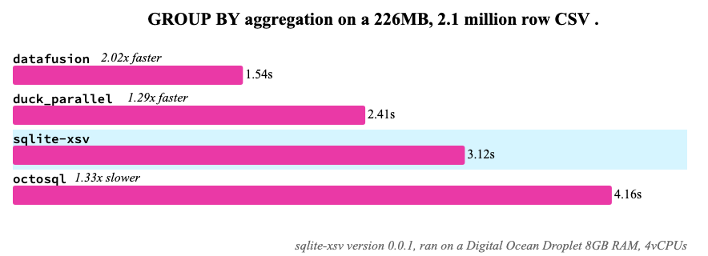

# sqlite-xsv Benchmarks

## Counting records in a CSV file

This benchmarks instructs various CSV tools to count the number of records in a [real-world CSV file](https://github.com/datadesk/california-coronavirus-data/blob/master/latimes-place-totals.csv), which is 75MB in size with over 1.1 million rows.

We can see `sqlite-xsv` outperforms nearly all other tools in this benchmarks, including new-age performant tools like DuckDB, DataFusion, Polars, and more. This is most likely because `sqlite-xsv` uses the [`.read_record()`](https://docs.rs/csv/latest/csv/struct.Reader.html#method.read_record) API in the `csv` crate, which limits the number of underlying memory allocations for extremely high throughput.

But keep in mind: _this is an extremely narrow and limited benchmark._ Counting rows in a CSV only tests how fast a CSV can be read, which is rarely the only thing you care about.

## Aggregating values from a CSV

Here we see where `sqlite-xsv` falls short compared to new-age tools like DuckDB/DataFusion/Polars etc. Those tools use new techniques (algorithms, data structures, vectorized operations, etc.) when performing aggregation calculations, like `GROUP BYs`. For `sqlite-xsv`, those operations are handed over to the SQLite virtual machines, which uses traditional yet slow B-trees for those calculations, showing a significant difference.

## Advice

If all your doing is ripping through CSVs and saving them to SQLite tables, then `sqlite-xsv` is the fastest CSV SQLite extension that will do just that, with the best ergonomics. But if you want to perform analytical-like queries directly on top of CSV files (without manual indicies), then DuckDB, Polars, and DataFusion rank supreme.
